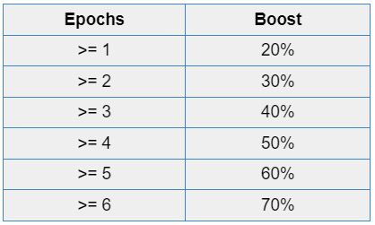
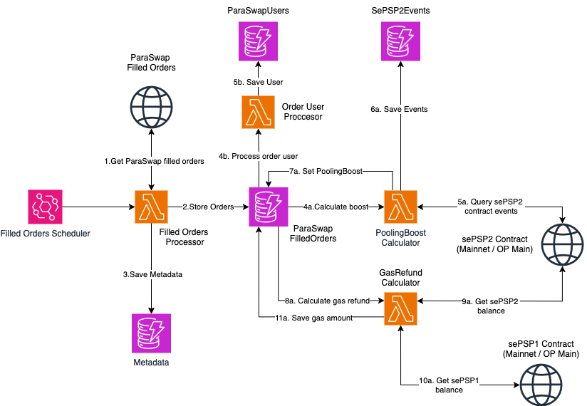
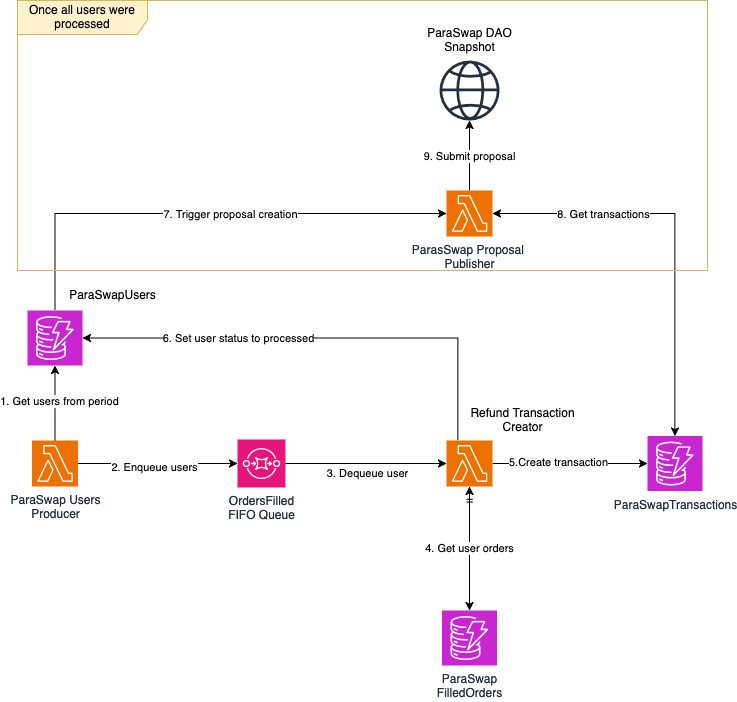
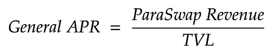
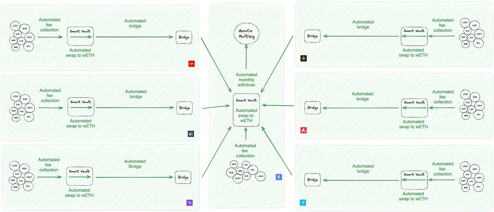
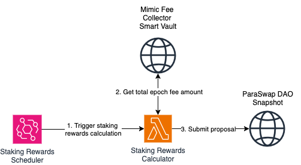

# PIP-55: Reward Mechanism Automation proposal by WakeUp Labs

**Mission**: [PIP-55- Reward Mechanism Automation proposal](https://gov.paraswap.network/t/pip-55-reward-mechanism-automation-proposal/2003)

# Milestone 1: Technical Research

## Overview

In alignment with the ParaSwap DAO's initiative to streamline the staked PSP incentive system as outlined in [PIP-53](https://gov.paraswap.network/t/pip-53-streamlining-of-the-staked-psp-incentive-system/1813), this project focuses on optimize and automate the reward distribution processes for the Gas Refund Program as well as the Staking Rewards Program, ensuring efficiency and transparency in rewarding users, reducing manual work, minimizing human error, and supporting decentralization while ensuring compliance.

At the end of each epoch (a period of 28 days), we will calculate how much gas did the user spend to be refunded in **sePSP1** for the **Gas Refund Program** based on their **ParaBoostScore**, as well as the amount of **wETH** to be distributed due to **Staking Rewards.**

The heart of this initiative is the adoption of the new **ParaBoostScore** formula, streamlining the evaluation of user engagement on the platform. This involves automating the submission of reward distribution proposals to SnapShot through the backend, leveraging **oSNAP** to execute on-chain actions without requiring manual signatures from the multisig. This approach aligns with the DAO's approved and voted decisions on these matters.

> _This automation also accounts the 0.75% monthly fee allocated to WakeUp Labs on the total amount of ETH paid for these Programs. (So, the fee applies for to the Staking Rewards)._

This document outlines the architectural and technical decisions made to implement and automate this reward mechanism.

> To add clarity and improve the nomenclature throughout the document, we added subscripts to the formulas to represent the addresses `i` (mostly from users), `n` as the “number” of transaction. Additionally, `t` represents the number of Epochs.
>
> Following this logic, `I`, `N`, and `T` respectively represent the last address, the last transaction, and the last Epoch.

```math
\small
\begin{aligned}
i & : \text{address} \\
t & : \text{number of Epoch} \\
n & : \text{number of transaction}
\end{aligned}

```

## User’s ParaBoostScore per Transaction Calculation

As previously mentioned, the **ParaBoostScore** formula has been updated to a simplified form as follows:

```math
\scriptsize \text{ParaBoostScore}_{i,n} = \left(\text{PSP Staked in sePSP1}_{i,n} + 2.5 \cdot \text{PSP Staked in sePSP2}_{i,n}\right) \cdot \left(1 + \text{ParaBoost}_{i,n}\right)
```

### Components of the Formula

1. **PSP staked in sePSP1 on the staker’s wallet**
   - Represents the total amount of **PSP** staked in **sePSP1** in the user’s wallet at the time of the transaction using the Augustus V6.2 or ParaSwap Delta contract sets.
   - This value includes PSP staked on both **Ethereum Mainnet** and **Optimism**.
2. **PSP staked in sePSP2 on the staker’s wallet**
   - Represents the total amount of **PSP** staked in **sePSP2** in the user’s wallet at the time of the transaction using the Augustus V6.2 or ParaSwap Delta contract sets.
   - This value includes PSP staked on both **Ethereum Mainnet** and **Optimism**.
3. **ParaBoost: Sum of all the existing boosts available**

   > \*Currently, the only existing boost is the **Pooling Boost.\***

### **Pooling Boost Relative to Number of Epochs**

- This factor measures the boost granted based on:
  1. The duration of **sePSP2** token staking, measured in **epochs**.
  2. The staked balance of **PSP** in the pool for each user. If the balance falls below 60,000 PSP at any point during an epoch, the **Pooling Boost** for that epoch is lost, and the boost will reset.
- The boost increases with the number of epochs the tokens have been staked, as illustrated in the following chart:



By combining these components, the **ParaBoostScore** determines the user’s overall eligibility and reward percentage within the gas refund program.

To correctly calculate the user’s **ParaBoostScore** for each transaction during implementation, the following steps must be performed:

1. **Retrieve Staked Balances:**
   - Retrieve the total balance of **PSP** staked in **sePSP1** by the user at the time the transaction was processed.
   - Retrieve the total balance of **PSP** staked in **sePSP2** by the user at the time the transaction was processed.
2. **Compute the User’s Pooling Boost:**
   - Calculate the **Pooling Boost** at the time of the transaction, factoring in:
     - The duration of staking, measured in **epochs**.
     - The amount of **PSP** staked in **sePSP2**.
   - Ensure that no factors affecting the boost calculation are disrupted or compromised during the process.

## Gas Refund Program & Implementation:

The program was simplified in both [PIP-55](https://gov.paraswap.network/t/pip-55-reward-mechanism-automation-proposal/2003) and [PIP-53](https://gov.paraswap.network/t/pip-53-streamlining-of-the-staked-psp-incentive-system/1813), as it now only refunds the gas consumed on the Ethereum mainnet for transactions generated using the Augustus V6.2 and ParaSwap Delta contract sets.

> _For a deeper understanding of the Refund Program, we recommend reading: [What is the Gas Refund Program?](https://help.paraswap.xyz/en/articles/6554757-what-is-the-gas-refund-program)_

The steps for implementing this program refund are as follows:

1. **Determine the refund percentage for each transaction performed by each user:**
   - Collect all transactions conducted using the **Augustus V6.2** and **ParaSwap Delta** contract sets on the Ethereum mainnet within the specified epoch.
   - Calculate the **ParaBoostScore** for each user's transaction based on the previously explained logic.
   - Use the **ParaBoostScore** of each user's transaction to determine the gas refund amount, applying the following formula:

```math
\scriptsize \text{Refund Percentage}_{i,n} = 0.152003 \cdot \ln\left(0.000517947 \cdot x_{i,n}\right)
```

where `x` is the ParaBoostScore. The refund levels based on this formula are as follows:

| **ParaBoost Score** | **Approximate Refund**     |
| ------------------- | -------------------------- |
| 10,000              | 25% (Minimum Refund Value) |
| 100,000             | 60%                        |
| 500,000             | 85%                        |
| 1,000,000           | 95% (Maximum Refund Value) |

2. **Determine the total gas in $PSP paid by the user for each transaction at the time of execution:**
   - Collect all transactions done using the Augustus V6.2 and ParaSwap Delta contract sets on the Ethereum mainnet within the specified epoch.
   - Identify the amount of gas used for each transaction.
   - Determine the USD amount paid by the user for gas at the time each transaction was executed.
   - Retrieve the PSP price at the time of each transaction.
   - Compute the PSP amount required for refunding each transaction using the formula:

```math
    PSP \, \text{to Refund}_{i,n} = \frac{\text{USD used for gas}_{i,n} \times \text{Refund Percentage}_{i,n}}{\text{PSP price}_n}
```

3. **Generate Gas Refund Transactions**:
   - Calculate the total PSP amount to refund for each user by adding up the PSP refund amount of each transaction previously calculated.
   - Calculate the total PSP refund amount for all users combined.
   - Create refund transactions for each network (e.g., **Mainnet** and **Optimism**), proportional to the total staking balance on each network at the time of the epoch.
   - Since the PSP to refund will be sent in **sePSP1**, multiple transactions should be executed simultaneously, and the transaction created must account for all of them. An example of such execution can be found here:
     https://app.safe.global/transactions/tx?safe=eth:0x619BBf92Fd6bA59893327676B2685A3762a49a33&id=multisig_0x619BBf92Fd6bA59893327676B2685A3762a49a33_0x0fe838a81adee44bf7fc1086c6f4888c2b963b2db7f6a98eee1c77c691cf5c65
4. **Key considerations:**
   - A **ParaBoostScore** of at least **10,000** is required to qualify for the minimum refund of 25%.
   - The DAO has allocated a total of **$30 million PSP** for the Gas Refund Program, distributed as **sePSP1**.
   - The maximum refund per epoch is **$500 per user**, with an annual limit of **$30,000 per user**.
5. **Publish DAO Proposal**:
   - Submit a proposal on the **ParaSwap DAO Snapshot** platform that includes the executable transaction code generated in Step 3, along with an explanation of the process.
   - Ensure the proposal integrates **oSnap**, allowing for automatic on-chain execution upon approval, eliminating the need for manual multisig transaction signing.
   - Two separate proposals are required: one for the transaction on **Mainnet** and another for **Optimism**.

### Architecture (Will change)

**Retrieve Transactions**

Given the potentially high volume of transactions, processing all events at once would be unnecessary. To address this, we will implement a daily job that retrieves orders incrementally, ensuring a balanced and efficient workflow.

To achieve this, we will use a specialized indexing and querying tool like [Subgraph](https://thegraph.com/) designed to efficiently retrieve blockchain event data. Such tools are significantly more performant and scalable than querying events directly from the smart contract, enabling faster and more reliable access to the required data.

Here is an overview of the orders retrieval implementation:

1. Daily Job Execution:
   - A **Lambda function** will be triggered once per day using an **Amazon EventBridge** scheduler.
   - The function will query for newly filled orders and insert the results as new documents into the `OrdersFilled` DynamoDB table.
2. Data Structure:

   - Each filled order will be stored as a document in the following format:

   ```jsx
   {
       "id": string,
       "account": string,
       "srcToken": string,
       "destToken": string,
       "txHash": string,
       // right now we account for L1 rollup price (on optimism). If we only account for Mainnet from now on, then it's not applicable any more
       "txGasUsed": string,        
       "date": string,
       "epoch": number
       "status": Enum,
       "sePSP1Balance": number,
       "sePSP2Balance": number,
       "poolingBoost": number,
       "paraBoostScore": number,
       "gasToRefund": {
           "mainnet": number,
           "op": number
        }


      // will it be possible to have a view, where all the transactions eligible for refund, include ALL the fields -- the "raw" or "source" values at the time of txs (such as gasUsed, nativeTokenUSDPrice, sePSP1Wei, sePSP2Wei, stake_bpt_total_supply, bpt_psp_balance etc) combined with the "computed" values (like pspInSePSP2Wei, etc), that are derived from the first ones, so that each transaction eligible for redund can be located and verified in isolation?

      // I'm thinking something like this: https://docs.google.com/spreadsheets/d/1wkfitLvmkwr7azpoGor8wtbWZtEHcgdD6bA73bfdsyw/edit?gid=1365866329#gid=1365866329
      // 
   }
   ```

   - The following properties will be extracted directly from the `OrderFilled` event:
     - `id`
     - `account`
     - `srcToken`
     - `destToken`
     - `txHash`
     - `txGasUsed`
     - `timestamp`
   - Remaining properties will be calculated and updated during the processing workflow.

To optimize subsequent job executions, metadata about the last processed block will be stored in DynamoDB:

```jsx
{
    "lastExecution": timestamp,
    "lastBlock": number
}
```

**Disclaimer**

While Lambda is used for its simplicity, it may not be optimal for large transaction volumes due to its 15-minute execution limit. Other solutions, such as containerized batch jobs, could be explored if performance issues arise.

**ParaSwap User Registration**

To track users interacting with the ParaSwap platform during an epoch and monitor their status during the automation process, a `ParaSwapUsers` DynamoDB table will be used. Each user will be recorded with the following document structure:

```jsx
{
    address: string,
    epoch: number,
    status: enum
}
```

**Transactions Processing**

**Pooling Boost Calculation**

This process will be carried out by a Lambda function.

In the same way we did for Filled Order transactions we’ll use an indexing tool to query for **sePSP2** contract events.

Calculation Workflow

1. Querying Events:
   - A **Lambda function** will look for **sePSP2** contract `deposit` and `withdrawal` events from the current date and up to 7 epochs in the past on both **Mainnet** and **Optimism (OP Main)**.
2. Eligibility Check:
   - The Lambda function will verify that the user has staked a minimum of **60,000 PSP**, which is required for granting the `PoolingBoost`.
3. Boost Calculation:
   - Using the retrieved events, the function will calculate the `PoolingBoost` coefficient based on the staking duration (in epochs) and the amount of PSP staked.
   - The calculated value will be stored in the `poolingBoost` field of the corresponding document in the `OrdersFilled` table.
4. Optimizing Event Retrieval:
   - To minimize redundant queries to the Subgraph during successive executions, all retrieved events will be cached in a DynamoDB table named `SePSP2Events`.
   - This ensures efficient lookups for future calculations and reduces dependency on repeated Subgraph queries.

**SePSP2Events Table Structure**

The `SePSP2Events` table will store the following fields:

```jsx
{
    "blockNumber": number
    "eventType": DEPOSIT | WITHDRAWAL
    "amount": number
    "date": timestamp
}
```

**Gas Refund Calculation**

Once the `PoolingBoost` is calculated, a Lambda function will be triggered to compute and update the gas refund for each order.

Workflow

1. Retrieve User Balances:
   - Query the user’s **sePSP1** balance on both **Mainnet** and **Optimism (OP Main)**.
   - Query the user’s **sePSP2** balance on both **Mainnet** and **Optimism (OP Main).**
2. Calculate ParaBoostScore:
   - Use the retrieved `sePSP1` and `sePSP2` balances along with the previously calculated `PoolingBoost` to compute the **ParaBoostScore**.
3. Determine Gas Refund Amount:
   - Leverage the **ParaBoostScore** to calculate the total gas refund amount for the transaction.
   - Allocate the refund proportionally across networks (**Mainnet** and **OP Main**) based on the user’s staking balances on each network.
4. Update Order Details:
   - Update the corresponding `OrdersFilled` document with the following values:
     - **sePSP1Balance**: The user’s total `sePSP1` balance at the time of the transaction.
     - **sePSP2Balance**: The user’s total `sePSP2` balance at the time of the transaction.
     - **paraSwapScore**: The calculated score based on user balances and `PoolingBoost`.
     - **gasToRefund**: The calculated gas refund amounts for each network.
     ```jsx
     gasToRefund: {
         "mainnet": number,
         "op": number
     }
     ```

**Transaction Processing Architecture Diagram**



**Gas Refund Transactions Generation**

At the end of each period, a job will process all users registered in the `ParaSwapUsers` table to generate gas refund transactions for eligible users on both **Mainnet** and **Optimism (OP Main)** networks.

**Implementation Workflow**

1. Job Initialization:
   - A Lambda function will enqueue all users from the `ParaSwapUsers` table into an **SQS Queue**.
   - This ensures users are processed sequentially and enables parallel execution through multiple workers.
2. Processing Users:
   - A Lambda worker will dequeue each user from the SQS Queue and execute the following steps:
     1. Query User Orders:
        - Retrieve all orders associated with the user from the `OrdersFilled` table.
     2. Calculate Refund Amounts:
        - Sum the gas refund amounts across all eligible orders for each network (**Mainnet** and **OP Main**).
     3. Apply Gas Refund Limits:
        - Check and enforce gas refund limits per user as specified by the system.
3. Transaction Generation and Storage:
   - Generate gas refund transactions for each user on the applicable networks.
   - Store the transaction details in the `UsersRefundTransactions` DynamoDB table with the following structure:
     ```jsx
     {
         "address": string,
         "amount": string,
         "chain": MAINNET | OP_MAIN
     }
     ```
   - Generate gas refund transactions that account for all the gas to be refunded to users for each applicable network.
   - Store the transaction details in the `RefundTransactions` DynamoDB table with the following structure:
     ```jsx
     {
         "amount": string,
         "chain": MAINNET | OP_MAIN
     }
     ```

**Publish DAO Proposal**

Once all refund transactions have been created and stored, a Lambda job will handle the publishing of a proposal to the ParaSwap DAO Snapshot. This ensures transparency and allows the community to review and approve the gas refund distributions.

**Workflow**

- Conversion to PSP:
  - For each refund transaction, the gas refund amount (denominated in the native network token) will be converted into **PSP** when the transaction is processed.
  - The conversion will use the current exchange rate fetched from a reliable oracle or decentralized exchange.
- Publishing to ParaSwap DAO Snapshot:
  - The proposal will be published to the ParaSwap DAO Snapshot using the [oSnap](https://docs.uma.xyz/developers/osnap) library.
  - The oSnap library will streamline the proposal submission and integrate with DAO governance processes.

**Transactions Generation and Proposal publishing architecture diagram**



## Staking Rewards & Implementation

As previously proposed with the PSP 2.0 update on [the forum](https://gov.paraswap.network/t/psp-ip-22-psp-2-0-revised-voting-edition/1207), ParaSwap distributes 80% of the protocol fees to stakers and 20% to the DAO treasury, which will be used for future DAO development.

This allows stakers to earn an APR on their staked PSP.



> To learn more, we recommend reading: [How is the APR calculated?](https://help.paraswap.xyz/en/articles/8496002-how-is-the-apr-calculated)

While estimated APRs could be calculated for users, in the particular case of WakeUp Labs and for the purpose of automating transactions, the main focus is to clearly identify ParaSwap Revenue and how much of it is distributed to users.

The fees from all chains where ParaSwap is deployed should be consolidated, and their distribution should occur at the end of every epoch.

These fees are initially collected in the gas token of each network. However, due to a business decision agreed upon by the DAO, it was decided to convert these fees into wETH, which will be held in the GovCo Multisig on the Ethereum mainnet.

To facilitate this, the DAO decided to use the **Mimic Fee Collector** (see [PSP-PIPΔ34 Proposal ParaSwap Fee Collector v2.1](https://gov.paraswap.network/t/psp-pip-34-proposal-paraswap-fee-collector-v2-1/1484) for more details) to aggregate the total fees collected during an epoch.

This tool automates the fee collection process from all chains where ParaSwap operates, consolidating them into a single Smart Vault. The following graphic illustrates the fee collection process:



These are the steps for the fees reward distribution:

1. Retrieve the total fees collected by ParaSwap during an Epoch from the **Mimic Fee Collector** smart vault. 100% of the fees, already in Ethereum, are transferred to the GovCo Multisig once a month.
   - The GovCo Multisig in Ethereum is: https://app.safe.global/home?safe=eth:0x619BBf92Fd6bA59893327676B2685A3762a49a33
   - The GovCo Multisig in Optimism is: https://app.safe.global/home?safe=oeth:0xf93A7F819F83DBfDbC307d4D4f0FE5a208C50318
2. Calculate the fee amount to be distributed among stakers, which according to the documentation is **80% of the total fees collected during the epoch.**
3. **WakeUp Labs** will take a **fee of 0.75% in wETH** from the **total amount to be distributed** during the Epoch, with a Max cap of $1500.
4. Create wETH transfers transactions for each network (**Mainnet** and **Optimism**), proportional to the total staking balance on each network at the time of the epoch.
5. **Publish DAO Proposal**:
   - Submit a proposal on the **ParaSwap DAO Snapshot** platform that includes the executable transaction code generated in Step 4, along with an explanation of the process.
   - Ensure the proposal integrates **oSnap**, allowing for automatic on-chain execution upon approval, eliminating the need for manual multisig transaction signing.
   - Two separate proposals are required: one for the transaction on **Mainnet** and another for **Optimism**.

### Architecture (Will change)

A **Lambda function** will be triggered at the end of every epoch using an **Amazon EventBridge** scheduler. It will be in charge of:

1. Request the total epoch fee amount from **Mimic Fee Collector** smart vault (or the GovCo Ethereum Multisig).
2. Apply the appropriate formula to calculate the total fee rewards to be distributed among stakers, as well as the 0.75% fee allocated to WakeUp.
3. Create two transactions to distribute the Staking Rewards on each network (e.g., Mainnet and Optimism). The distribution should be proportional to the total staking balance on each network at the time of the Epoch.
4. Publishing to ParaSwap DAO Snapshot:
   - The proposal will be published to the ParaSwap DAO Snapshot using the [oSnap](https://docs.uma.xyz/developers/osnap) library.
   - The oSnap library will streamline the proposal submission and integrate with DAO governance processes.
   - To implement this correctly, two proposals are required: One for the transaction on Mainnet and another for Optimism.



## Proof of Concept

To validate the architectural decisions outlined in this research document, we conducted several Proof of Concept (POC) implementations:

1. **Transaction Retrieval**:
   - A POC was implemented to query filled orders using the [ParaSwap Subgraph](https://thegraph.com/explorer/subgraphs/52s5K2JhW4xojAUEEEEKpVidtZXoT2wvg7dT9rRtT5Nn?view=Query&chain=arbitrum-one).
   - This allowed us to confirm the feasibility of retrieving filled orders for specific periods and evaluate the query performance, including the volume of results returned.
2. **Proposal Submission**:
   - A POC was conducted to test proposal submission using the [oSnap](https://uma.xyz/osnap) library.
   - This validated the process for creating and submitting proposals to “Test DAO Snapshot Space”, ensuring the future integration with ParaSwap DAO.

All POC implementations, including their code and configurations, have been documented and uploaded to the following [repository](https://github.com/wakeuplabs-io/paraswap-rewards-automation-research) for reference and further exploration.

> _Although the POC, in its current state, is 'vague' or may contain calculation or execution errors, it allowed us to validate that the entire flow is possible without the need for human interaction or execution._

## Disclaimer

All architectural decisions presented in this repository were made based on the outcomes of initial research and are not final. They may be subject to change in future iterations of the solution.
